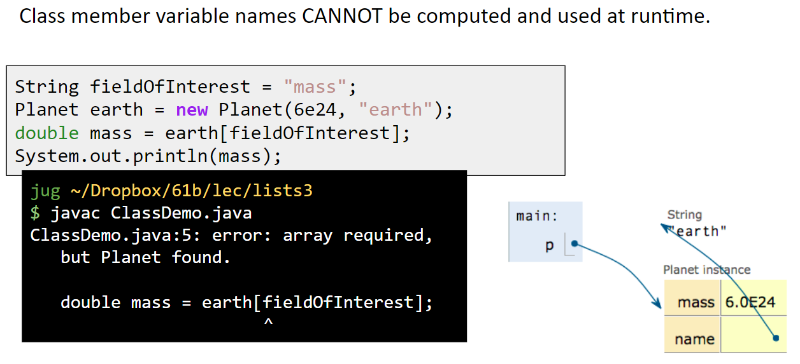

# CS61b
CS61b Data Structures, Spring 2019 UC Berkeley 

## Lecture 4. SSLists, Nested classes, Sentinel Nodes. 
### From IntList to SLList
Rewrite IntList to SLList
```
public class SLList {
	public IntNode first;

	public SLList(int x){
		first = new IntNode(x, null);
	}

	/* Adds x to the front of the list */
	public void addFirst(int x){
		first = new IntNode(x, first);
	}

	/* Returns the first item in the list. */
	public int getFirst(){
		return first.item;
	}

	public static void main(String[] args){
		/* Creates a list of one integer, namely 10*/
		SLList L = new SLList(10);
		L.addFirst(10);
		L.addFirst(5);
		System.out.println(L.getFirst());
	}
}
```
IntList vs. SLList


* SLList is easier to instantiate (no need to specify null)
* Simpler to use. Simply use the provided methods. 
* SLList creates a middle between user and data structure. 


### Public vs. Private Nested Classes
Problems: Users of our class might be tempted to try to manipulate secret IntNode directly 


 

Solution: <br/>
***a) Use the ```Private``` keyword to prevent code in other classes from using members of a class. <br/>***
Why Restrict Access?<br/>
* Less for user of class to understand
* Safe for you to change private methods. <br/>

***b) Use Nested class <br/>***
Why Nested Class?<br/>
* when a class doesn't stand on its own and is above subordinate to another class.
	
Statis Nested Classes: If the nested class never uses any instance variables or methods of the outer class, declare is static.
* Static classes can't access outer class's instance variables or methods.
* Results in a minor savings of memory.
   

	
### Adding More SSList Functionality
***.addLast(int x)***
```public void addLast(int x):
	IntNode p = first;
	
	/* Move p until it reaches the end of the list */
	while (p.next != null) {
	     p = p.next
        }
	p.next = new IntNode(x, null);
```

***.Size()***
```
/** Returns the size of the list that starts at IntNode P. **/
private statis nt size(IntNode p){
    if (p.next == null){
    	return 1;
    }
    return 1 + size(p.next)
}
public int size(){
     return size(first);
}
```
### Caching 
Goal: Modify SLList so that the execution time of size() is always fast(i.e. independent of the size of the list). <br/>
Solution: Maintain in a special size variable that caches the size of the lists.
* Caching: putting aside data to speed up retreval. 
```
private static class IntNode {
    public int item;
    public IntNode next;
    
    public IntNode(int i, IntNode n){
        item = i;
	next = n;
    }
 }
 
 private IntNode first;
 private int size;
 
 public SLList(int x){
     first = new IntNode(x, null);
     size = 1;
 }
 
 public void addFirst(int x){
     first = new IntNode(x, first);
     size += 1;
}

public int getFirst(){
    return first.item;
}

public void addLast(int x){
	size += 1;
	
	IntNode p = first;
	
	/* Move p until it reaches the end of the list */
	while (p.next != null) {
	     p = p.next
        }
	p.next = new IntNode(x, null);
}

private int size(){
	return size;
}
```
* Middle man in SSList can store information about entire list. Object oriented approach means that we let the object control everthing. <br/>
* Naked Linked Lists has to update a bunch of size variables when changes something in the list. Finaly will end up multiple variables that have to keep straight. 


### Sentinel Node
Create a special node that is always there - Sentinel node.


Notes: <br/>
* First is renamed to be sentinel.
* Sentinel is never null, always points to sentinel node. 
* Sentinel node's item needs to be integer, but doesn't matter what value we pick. 
* How to fix constructors and methods to be compatible with sentinel node. 


### Invariants
An invariants is a condition that is guaranteed to be true during code execution. <br/>

An SLList with a sentinel node has at least the following invariants:
* The sentinel reference always points to a sentinel node. 
* The first node, if always at sentinel.next.
* The size variable is always the total number of items that have benn added. 

```public class SLList {	
	private static class IntNode {
		public int item;
		public IntNode next;

		public IntNode(int i, IntNode n) {
			item = i;
			next = n;
			System.out.println(size);
		}
	} 

	/* The first item (if it exists) is at sentinel.next. */
	private IntNode sentinel;
	private int size;

	private static void lectureQuestion() {
		SLList L = new SLList();
		IntNode n = IntNode(5, null);
	}

	/** Creates an empty SLList. */
	public SLList() {
		sentinel = new IntNode(63, null);
		size = 0;
	}

	public SLList(int x) {
		sentinel = new IntNode(63, null);
		sentinel.next = new IntNode(x, null);
		size = 1;
	}

 	/** Adds x to the front of the list. */
 	public void addFirst(int x) {
 		sentinel.next = new IntNode(x, sentinel.next);
 		size = size + 1;
 	}

 	/** Returns the first item in the list. */
 	public int getFirst() {
 		return sentinel.next.item;
 	}

 	/** Adds x to the end of the list. */
 	public void addLast(int x) {
 		size = size + 1; 		

 		IntNode p = sentinel;

 		/* Advance p to the end of the list. */
 		while (p.next != null) {
 			p = p.next;
 		}

 		p.next = new IntNode(x, null);
 	}
 	
 	/** Returns the size of the list. */
 	public int size() {
 		return size;
 	}

	public static void main(String[] args) {
 		/* Creates a list of one integer, namely 10 */
 		SLList L = new SLList();
 		L.addLast(20);
 		System.out.println(L.size());
 	}
}
```

## Lesson 5. DLLists, Arrays
### Doubly Linked lists
***Naive*** <br/>
Problem: last pointer sometimes points at the sentinel, and sometimes points at a 'real' node. When code, have to check and see if it's actually the sentinel. So hard to code up. 


***Double Sentinel*** <br/>
Have two sentinels. 


***Circular Sentinel***<br/>
Even better topology (IMO): Have one sentinel that is both the front and the back. 


***Generic Lists***<br/>
A method can used in different data types. 
Java allows us to defer type select until declaration, 


### Array
***Get Memory Boxes***<br/>
To story information, we need memory boxes, which we can get in Java by declaring variables or instantiating objects. Examples: <br/>
* int x <- a memory box of 32 bits that store int.
* Walrus w1 <- a memory box of 64 bits that store Walrus reference.
* Walrus w2 = new Walrus(30, 5.6) <- a memory box of 64 bits that store Walrus reference and also gives 96 bits for storing the int size               (32 bits) and double tuskSize(64 bits) for Walrus.<br/>

Array are a special kind of object which consists of a numbered sequence of memory boxes.
* To get ith item of array: A[i].
* Unlike class instance which have have named memory boxes. a class is a named set of memory boxes; array is a numbered sequence. 

***Arrays***<br/>
Arrays consist of:
* A fixed integer length(can't change)
* A sequence of N memory boxes where N = length, such that:
	* All of the boxes hold the same type of value (and have same # of bits).
	* The boxes are numbered 0 through length -1
	
Like instances of classes:
* You get one reference when its created.
* If you reassign all variables containing that reference, you can never get the array back. 

Unlike classes, arrays do not have methods. <br/>

Three valid notations:
* y = new int[3]; <-- creates array containing 3 ints boxes. Each container gets a default value. 
* x = new int[]{1,2,3,4,5};
* int[] w = {9,10,11,12,13} <-- Can omit the new if you are also declaring a variable. 

***Arraycopy*** <br/>
Two ways to copy arrays:
* Item by item using a loop.
* Using arraycopy. Takes 5 parameters:
	* Source array
	* Start position in source
	* Target array
	* Start position in target
	* Number to copy 
  System.arraycopy(b,0,x,3,2)
  arraycopy is faster, particularly for large arrays. More compact code.
  * Code is harder to read. 
  
### 2D Arrays
***Arrays vs. Classes***<br/>
Arrays and Classes can both be used to organize a bunch of memory boxes.
* Array boxes are accessed using [] notation.
* Class boxes are accessed using dot notation. 
* Array boxes must all be of the same type. 
* Class boxes may be of different types.
* Both have a fixed number of boxes.
* Array indices can be computed at runtime.

* Class number variable names cannot be computed and used at runtime.

